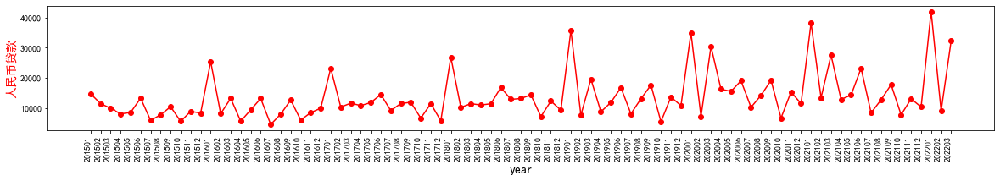
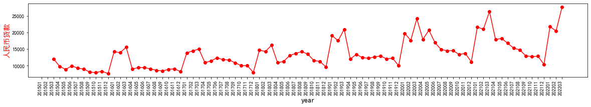
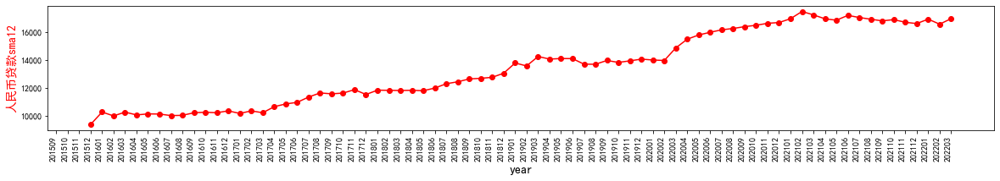
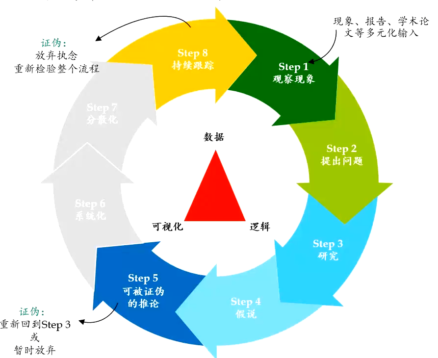
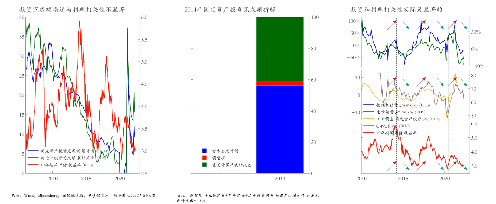

## 从数据和实践中获得经济的感觉

宏观经济的研究是一个很虚的东西，在目前的自媒体和碎片化时代，不难看到很多大V或者媒体会根据某个数据去宣告，中国经济完蛋了。或者根据某几个指标的转折和你说我们进入了周期的某个阶段。当你一开始去了解并深究这些言论的时候，你会很兴奋，似乎你掌握了某种屠龙之技。因为好像一些事情是理所当然的，市场经济有周期，掌握周期阶段就好像看穿了市场的发展一样。而另一些知识看起来似乎能预测经济整体，他们通常被叫做先行指标。举一些关于社融数据的例子:

我们先考虑SMA3，让经济数据看起来周期性强一点

人民币贷款看起来有一定的周期感，于是我们不妨考虑SMA12

有些研究者或者研报，比如会告诉你，这叫长期增长与经济周期（可以考虑阅读[经济增长与经济周期](https://www.htsec.com/jfimg/colimg/upload/20190826/29021566804092217.pdf))。但如果我们把人民币贷款放到一个更长的周期里，也许事情又有点变化。这些关于周期与增长的问题会困扰我们看数据的很多时刻。

另外一个问题是关于数据口径，宏观经济的很多属于是同比YoY，我们所面临困扰的一个时期是，这些数据能反应出经济的周期性吗，同比和环比统计口径的区别使得我们需要关注当我们画出一个看起来像周期的图的时候，需要多花点时间想想，因为我们对周期曲线的了解，往往来自于一种环比的变化趋势。

当我们去谈一些经济的周期，预测和相关性的时候，我们需要反复去思考一些关于数据口径，观察窗口的问题。这些依赖于一些基础的科学研究方法。可证伪性(falsification)是一个重要的因素。有一些人认为经济学无法有可证伪性，这些人举了一些宏观经济学的命题，尽管难以证伪，但却是有效。（可能对有些人来说比较困惑，举个例子，上海所有的天鹅都是白色的，这个现象是可以观测的，因为你去公园去看天鹅，但你没办法证伪，因为你很难去找到上海所有的天鹅），在实践工作中，可证伪性的意义在于我们可以坚持我们的论断或者说服别人相信我们的论断。张五常的[经济解释](https://m.douban.com/book/subject/26636765/)的第一卷比较友好地介绍了可证伪性和经济学的关系，另外一个比较严肃的讨论是[The Popperian Legacy in Economics](https://www.cambridge.org/core/books/popperian-legacy-in-economics/496986539005F83983D38E34B735E138). Popper Karl 是科学研究方法的总结者，也是20实际最伟大的哲学家之一。

有一些很好的去了解和认识宏观经济学书籍的dataset：

- IMF Article IV https://www.imf.org/en/Publications/CR/Issues/2022/01/26/Peoples-Republic-of-China-2021-Article-IV-Consultation-Press-Release-Staff-Report-and-512248, 这是一份年报型数据
- Understanding China's Economic Statistics – Second Edition，介绍经济指标如何统计以及他们的重要性
- 解读中国统计指标：概念，方法和含义（第二版）中金，字典

很多统计局提供的关键指标不能反映你想要的特性，比如投资完成额就是一个不太有用的指标

